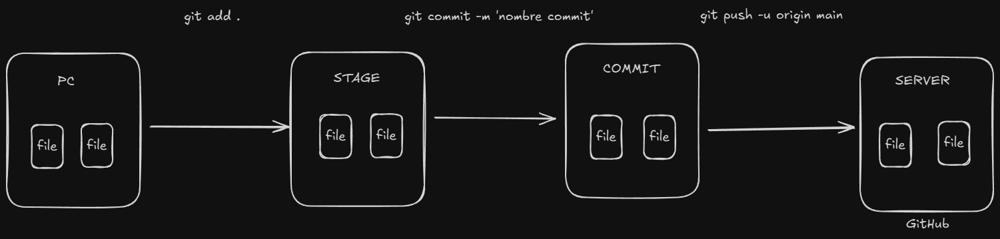

# Cheatsheet Git

```bash
# ===========================
# CONFIGURACIÓN INICIAL DE GIT
# ===========================

# Stage = área donde preparas cambios antes del commit (index)
# HEAD = el commit donde estás actualmente (puntero de trabajo)

# Configuramos el nombre de usuario que aparecerá en los commits
git config --global user.name "USERNAME"

# Configuramos el correo asociado a los commits (Git lo usa para identificar autoría)
git config --global user.email "mail@mail.com"

# Definimos Visual Studio Code como editor por defecto para Git
# --wait obliga a VSCode a esperar a que cierres el archivo para continuar el proceso (útil en merges y rebase)
git config --global core.editor "code --wait"

# Configuración del manejo de saltos de línea (CRLF/LF):
# Windows:
git config --global core.autocrlf true

# Linux/macOS:
git config --global core.autocrlf input

# Abre el archivo de configuración global para revisar o editar parámetros manualmente
git config --global -e


# ===========================
# COMANDOS BÁSICOS
# ===========================

# Inicializa un nuevo repositorio en el directorio actual
git init

# Muestra el estado del repositorio (archivos sin seguimiento, modificados o en stage)
git status

# Agrega un archivo al área de preparación (stage)
git add nombreDeArchivo.txt

# Agrega TODOS los archivos modificados al stage
git add .

# Realiza un commit con un mensaje descriptivo
# Convención recomendada: tipo: descripción (add, fix, feat, refactor, docs, chore…)
git commit -m "add: create login form"

# Elimina un archivo del repositorio y del disco
git rm nombreDeArchivo.txt

# Restaura un archivo al último estado confirmado (descarta cambios locales)
# Equivalente moderno de: git checkout nombreDeArchivo.txt
git restore nombreDeArchivo.txt

# Quita un archivo del stage sin perder cambios locales
# Equivalente moderno de: git reset HEAD nombreDeArchivo.txt
git restore --stage nombreDeArchivo.txt

# Cambiar a una rama existente
# Equivalente moderno de: git checkout nombre-rama
git switch nombre-rama

# Crear y cambiar a una nueva rama
# Equivalente moderno de: git checkout -b nueva-rama
git switch -c nueva-rama


# ===========================
# DIFERENCIAS ENTRE VERSIONES
# ===========================

# Muestra un estado resumido (ideal para revisar rápidamente cambios)
git status -s

# Muestra diferencias entre el working directory y el stage
git diff

# Muestra diferencias entre el stage y el último commit
git diff --staged


# ===========================
# HISTORIAL DE CAMBIOS
# ===========================

# Lista el historial completo de commits
git log

# Lista el historial en un formato reducido (hash corto + mensaje)
git log --oneline

# Lista historial reducido de todas las ramas
git log --oneline --all

# Muestra los detalles completos de un commit específico (cambios incluidos)
git show id_commit


# ===========================
# RAMAS (BRANCHES)
# ===========================

# Lista todas las ramas existentes
git branch

# Renombra la rama actual a 'main'
git branch -M main

# Crea y cambia a una nueva rama
# Equivalente moderno: git switch -c nombre
git checkout -b nombre

# Cambia a una rama existente
# Equivalente moderno: git switch nombre
git checkout nombre

# Cambia a un commit específico (estado detached HEAD)
# Equivalente moderno: git switch --detach id_commit
git checkout id_commit

# Checkout sigue siendo útil para restaurar archivos y trabajar con commits antiguos
# (comando histórico aún válido en muchos proyectos)

# Fusiona una rama dentro de la rama actual
# Si hay conflictos, Git solicitará resolverlos antes de completar el merge
git merge nombre


# ===========================
# REPOSITORIOS REMOTOS
# ===========================

# Asocia el repositorio local con un remoto llamado 'origin'
git remote add origin url-repositorio

# Envía la rama actual al remoto por primera vez y establece el tracking
# "tracking" = Git recuerda hacia qué rama remota hace push y desde cuál hace pull
git push -u origin main

# Envía la rama actual al remoto usando la configuración de tracking ya establecida
git push

# Obtiene los cambios desde el remoto y los fusiona con tu rama local
git pull

# Trae los cambios del remoto y reescribe tus commits locales encima del historial actualizado
# Útil para evitar merges innecesarios
git pull --rebase origin main
```


## Flujo común para publicar cambios




```bash
# ===========================
# COMANDOS ADICIONALES
# ===========================

# Clona un repositorio remoto en tu equipo
git clone url-repositorio

# Corrige el último commit (mensaje o archivos agregados)
git commit --amend

# Muestra quién modificó cada línea de un archivo
git blame archivo.py

# Muestra el historial completo, incluyendo movimientos de HEAD
# (sirve para recuperar commits "perdidos")
git reflog


# ===========================
# MOVIMIENTO Y GESTIÓN DE ARCHIVOS
# ===========================

# Renombra o mueve un archivo conservando su historial
git mv archivo_viejo.py carpeta/nuevo_nombre.py


# ===========================
# USO DE STASH (TRABAJO TEMPORAL)
# ===========================

# Guarda temporalmente cambios sin hacer commit
git stash

# Recupera los últimos cambios guardados
git stash pop

# Lista los stashes guardados
git stash list


# ===========================
# RESET (DESHACER CAMBIOS DE MANERA CONTROLADA)
# ===========================

# Retrocede 1 commit manteniendo los cambios en stage
git reset --soft HEAD~1

# Retrocede 1 commit y deja los cambios en el working directory (quita del stage)
git reset --mixed HEAD~1

# Retrocede 1 commit y elimina cambios definitivamente (peligroso)
# Consejo: evita --hard a menos que estés 100% seguro
git reset --hard HEAD~1


# ===========================
# FETCH, REVERT Y OTROS
# ===========================

# Descarga cambios del repositorio remoto sin fusionarlos
git fetch

# Ver diferencias entre tu rama y el remoto (muy útil antes de pull)
git diff origin/main

# Revierte un commit creando un commit nuevo (no borra historial)
git revert id_commit

# Aplica un commit específico encima de tu rama actual (seleccionar commits)
git cherry-pick id_commit

# Reescribe commits de manera lineal (rebase simple)
# Útil cuando tu rama quedó atrás y quieres un historial limpio
git rebase nombre-rama

# Rebase interactivo para reordenar, editar o fusionar commits (avanzado)
git rebase -i HEAD~5


# ===========================
# ARCHIVO .gitignore
# ===========================

# .gitignore = indica qué archivos NO deben subirse al repositorio

# Ejemplos típicos de .gitignore en proyectos Python:
__pycache__/
*.pyc
.env
venv/
env/
*.log
*.sqlite3

# Si agregaste .gitignore tarde y Git ya seguía archivos, limpia el cache:
git rm -r --cached .
git add .
git commit -m "fix: aplicar .gitignore correctamente"
```